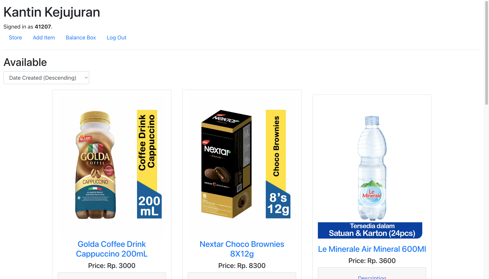

# Kantin Kejujuran
My submission for Compfest 14 SEA Website Challenge, written in Django.

## Screenshot


## Project Summary
The main page of this website displays the items available on the canteen. Logged in users can add item to the canteen or buy item from the store page. After buying, logged in users can proceed to balance box page to add or withdraw balance from the balance box according to their purchases (if they're honest). Unregistered user can only view the availabe item on the canteen. Student ID in registration and login page is referring to the Student ID of student in SD SEA Sentosa with special properties.

## Running this project
To get this project running you must have Python installed on your computer. Firstly you need to git clone or download this repository, then create a virtual environment to store the project dependencies separately. To create a virtual environment on macOS/Linux:
```
python -m venv .venv
```
Next activate it with this command on macOS/Linux:
```
source .venv/bin/activate
```
After that, install the project dependencies with:
```
pip install -r requirements.txt
```
Then, migrate the database with init.sh. Make it executable, then run it with:
```
chmod +x init.sh && ./init.sh
```
Now you can run the project with this command:
```
python manage.py runserver
```
*Note that this repository is using SQLite3, while the deployed app is using PostgreSQL, for security and testing's sake*
